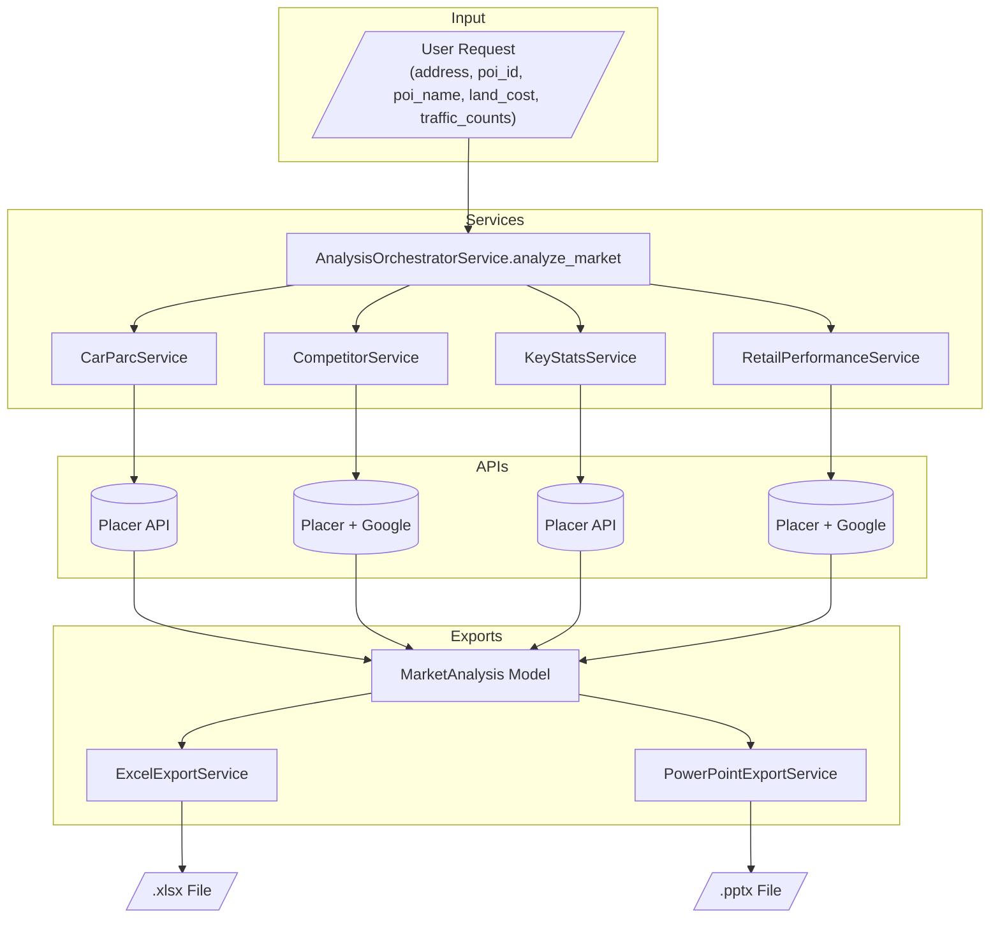

# Data Source Documentation: Services Feeding Excel & PowerPoint Exports

This document maps all external API calls and Python calculations in the data-gathering services.

---

## Data Flow Overview



---

## Date Range Calculation

**File:** `src/core/date_utils.py`

Most services use `get_last_12_months_date_range()` to calculate API date parameters:

```python
def get_last_12_months_date_range() -> tuple[str, str]:
    now = datetime.now()
    end_month = now.replace(day=1) - relativedelta(months=1)  # Previous month
    last_day = monthrange(end_month.year, end_month.month)[1]
    end_date = end_month.replace(day=last_day)  # Last day of previous month
    start_date = end_month - relativedelta(months=11)  # 11 months before end_month
    return start_date.strftime("%Y-%m-%d"), end_date.strftime("%Y-%m-%d")
```

**Example (if today is January 7, 2026):**
- `end_date` = "2025-12-31" (last day of December 2025)
- `start_date` = "2025-01-01" (January 1, 2025)
- Result: Full 12 months of **completed** months (excludes current partial month)

### Last 6 Months Date Range (for Loyalty Calculation)

CompetitorService uses the second half of `get_last_12_months_as_two_halves()` for loyalty member calculation (most recent 6 complete months).

**Example (if today is January 7, 2026):**
- Date range: "2025-07-01" to "2025-12-31"

---

## 1. CarParcService

**File:** `src/services/car_parc_service.py`

### API Calls Made

| API | Endpoint | Method | When Called |
|-----|----------|--------|-------------|
| Placer | `POST /v1/reports/trade-area-demographics` | POST | Once per drive time (5-25 min = 21 calls) |

**Exact Placer Payload:**
```python
{
    "method": "driveTime",
    "benchmarkScope": "nationwide",
    "allocationType": "weightedCentroid",
    "trafficVolPct": 70,
    "withinRadius": drive_time_minutes,  # 5-25 for tta only has no effect on method drivetime
    "ringRadius": 3,
    "dataset": "sti_popstats",
    "startDate": start_date,  # See date calculation below
    "endDate": end_date,      # See date calculation below
    "apiId": reference_poi_id,
    "driveTime": drive_time_minutes,
    "template": "default"
}
```

### Data Extracted from API Response

| Field | API Path |
|-------|----------|
| car_parc | `data["Vehicles per Household"]["Total Number of Vehicles"]["value"]` |
| population | `data["Overview"]["Population"]["value"]` |
| households | `data["Overview"]["Households"]["value"]` |

### Calculations Performed in Code

**TAM Percentage** (`calculate_tam_percentage`):
```python
KNOWN_DRIVE_TIMES = [10, 12, 15]
KNOWN_TAM_PERCENTAGES = [30, 25, 20]  # percent

tam_percentage = np.interp(drive_time_minutes, KNOWN_DRIVE_TIMES, KNOWN_TAM_PERCENTAGES)
tam_percentage = np.clip(tam_percentage, 10, 40) / 100  # Returns decimal 0.10-0.40
```

**Market Share Percentage** (`calculate_market_share_percentage`):
```python
KNOWN_MARKET_SHARE_PERCENTAGES = [95, 85, 65]  # percent

market_share = np.interp(drive_time_minutes, KNOWN_DRIVE_TIMES, KNOWN_MARKET_SHARE_PERCENTAGES)
market_share = np.clip(market_share, 40, 100) / 100  # Returns decimal 0.40-1.0
```

**Total Addressable Market**:
```python
total_addressable_market = int(car_parc * tam_percentage)
```

### Where These Calculations Are Used

#### PowerPoint Export Service

**TAM Cell** (`_add_tam_cell`):
```python
# Uses tam_percentage from 12-minute drive time result
tam = int(result_12min.car_parc * result_12min.tam_percentage)

# Then calculates:
implied_washes = tam / 5000  # assumed members per car wash
remaining_monthlies = tam - total_market_members
remaining_washes = remaining_monthlies / 5000
```

**Drive Time Table** (`_add_drive_time_cell`):

| Row | Data | Source |
|-----|------|--------|
| Car Parc | `result.car_parc` | From API |
| TAM % | `result.tam_percentage * 100` | Calculated in CarParcService |
| TAM | `car_parc * tam_percentage` | Recalculated in PowerPoint |
| Market Share % | `result.market_share_percentage * 100` | Calculated in CarParcService |
| Site Monthlies | `car_parc * tam_percentage * market_share_percentage` | Recalculated in PowerPoint |

#### Excel Export Service

**Important:** The Excel export **does NOT use** the calculated values from CarParcService!

```python
# Line 124 - HARDCODED values, ignores CarParcService calculations
tam_percentages = [0.30, 0.25, 0.20]
```

The Excel:
- Uses `car_parc` from the API via VLOOKUP
- Hardcodes TAM % as 30%, 25%, 20% for 10, 12, 15 min
- Calculates TAM in Excel formula: `=car_parc * tam_percentage`
- Calculates monthlies in Excel formula: `=TAM * market_share`

#### Usage Summary

| Calculation | PowerPoint Uses | Excel Uses |
|-------------|-----------------|------------|
| `tam_percentage` | Yes - from CarParcResult | No - hardcoded [0.30, 0.25, 0.20] |
| `market_share_percentage` | Yes - from CarParcResult | No - Excel formula from cell F63 |
| `total_addressable_market` | No - recalculates it | No - Excel formula |

**Note:** The `total_addressable_market` field in `CarParcResult` is **never directly consumed** - both exports recalculate it themselves.

---

## 2. CompetitorService

**File:** `src/services/competitor_service.py`

### API Calls Made (in order)

| Step | API | Endpoint | Method | Purpose |
|------|-----|----------|--------|---------|
| 1 | Placer | `GET /v1/poi` | GET | Search for car wash venues |
| 2 | Google | `POST /directions/v2:computeRoutes` | POST | Get drive time/distance per venue |
| 3 | Placer | `POST /v1/reports/visit-trends` | POST | Filter by visit threshold (50k+/year) |
| 4 | Placer | `POST /v1/reports/true-trade-area` | POST | Get reference POI trade area polygon |
| 5 | Placer | `POST /v1/reports/loyalty/visits-frequency` | POST | Get total members per competitor (last 6 months) |
| 6 | Placer | `POST /v1/reports/true-trade-area` | POST | Get competitor trade area polygon |
| 7 | Placer | `POST /v1/reports/trade-area-demographics` | POST | Get competitor TTA car parc |

### Exact API Payloads

**Step 1 - POI Search:**
```python
GET /v1/poi?lat={lat}&lng={lng}&radius=5.0&entityType=venue&limit=50&category=Car+Wash+Services&subCategory=Car+Wash
```

**Step 2 - Google Routes:**
```python
POST https://routes.googleapis.com/directions/v2:computeRoutes
Headers: X-Goog-FieldMask: routes.duration,routes.distanceMeters

{
    "origin": {"location": {"latLng": {"latitude": origin_lat, "longitude": origin_lng}}},
    "destination": {"location": {"latLng": {"latitude": venue_lat, "longitude": venue_lng}}},
    "travelMode": "DRIVE",
    "routingPreference": "TRAFFIC_AWARE",
    "computeAlternativeRoutes": false,
    "routeModifiers": {"avoidTolls": false, "avoidHighways": false, "avoidFerries": false},
    "languageCode": "en-US",
    "units": "IMPERIAL"
}
```

**Step 3 - Visit Trends:**
```python
{
    "apiIds": [list of venue apiIds],
    "granularity": "month",
    "visitDurationSegmentation": "default",
    "startDate": start_date,  # From get_last_12_months_date_range()
    "endDate": end_date       # From get_last_12_months_date_range()
}
```

**Step 4/6 - Trade Area:**
```python
{
    "apiId": poi_id,
    "startDate": start_date,  # From get_last_12_months_date_range()
    "endDate": end_date,      # From get_last_12_months_date_range()
    "tradeAreaType": "70percentTrueTradeArea"
}
```

**Step 5 - Loyalty Frequency (1 call per competitor):**

Uses the last 6 months (second half from `get_last_12_months_as_two_halves()`):

```python
{
    "apiId": venue_api_id,
    "startDate": start_date,  # e.g., "2025-07-01"
    "endDate": end_date       # e.g., "2025-12-31"
}
```

**Step 7 - TTA Demographics:**
```python
{
    "method": "tta",
    "benchmarkScope": "nationwide",
    "allocationType": "weightedCentroid",
    "trafficVolPct": 70,
    "withinRadius": 15,
    "ringRadius": 3,
    "dataset": "sti_popstats",
    "startDate": start_date,  # From get_last_12_months_date_range()
    "endDate": end_date,      # From get_last_12_months_date_range()
    "apiId": competitor_api_id
}
```

### Data Extracted from API Responses

| Field | Source | API Path |
|-------|--------|----------|
| venues | Placer POI | `data[*]` (list of Venue objects) |
| drive_time_minutes | Google Routes | `routes[0]["duration"]` (parse "Xs" → seconds/60) |
| distance_miles | Google Routes | `routes[0]["distanceMeters"]` × 0.000621371 |
| visits_per_year | Placer Visit Trends | `sum(data[apiId].visits)` (12 months) |
| total_members | Placer Loyalty | `sum(visitors[i])` where `bins[i] >= 6` (last 6 months) |
| trade_area_polygon | Placer Trade Area | `data.type`, `data.coordinates` → Shapely shape |
| car_parc (TTA) | Placer Demographics | `data["Vehicles per Household"]["Total Number of Vehicles"]["value"]` |
| tta_visits | Placer Demographics | `data["Overview"]["Visits"]["value"]` |

### Calculations Performed in Code

**Total Members** (`calculate_total_members`):

Uses a single 6-month API call (most recent 6 complete months):

```python
LOYALTY_MIN_VISITS = 6  # minimum 6 visits in last 6 months

def calculate_total_members(api_id, start_date, end_date):
    return _count_loyal_visitors(api_id, start_date, end_date)

def _count_loyal_visitors(api_id, start_date, end_date):
    # From loyalty API response:
    for i, bin_value in enumerate(bins):
        if bin_value >= 6 and i < len(visitors):
            loyal_visitors += visitors[i]
    return loyal_visitors
```

**Note:** Counts all visitors with 6 or more visits in the last 6-month period.

**Trade Area Overlap** (`calculate_trade_area_overlap`):
```python
# Using Shapely geometry
reference_polygon = shape(reference_geojson)
competitor_polygon = shape(competitor_geojson)

intersection = reference_polygon.intersection(competitor_polygon)
overlap_percentage = (intersection.area / competitor_polygon.area) * 100
```

**Members in Market**:
```python
members_in_market = int((overlap_percentage / 100) * total_members)
```

**Visit Aggregations**:
```python
visits_per_year = sum(monthly_visits)  # From API
visits_per_month = visits_per_year // 12
visits_per_day = visits_per_year // 365
```

**Drive Time Band** (`determine_drive_time_band`):
```python
if drive_time <= 10: return "0-10 min"
elif drive_time <= 12: return "10-12 min"
elif drive_time <= 15: return "12-15 min"
else: return "15+ min"
```

### Where These Calculations Are Used

#### PowerPoint Export Service

**Competitor Table** (`_write_third_slide`):
- Sorts competitors by `members_in_market` descending, takes top 8
- Displays directly:

| Column | Data | Source |
|--------|------|--------|
| Competitor | `competitor.name` | From API |
| Total | `competitor.total_members` | Calculated in CompetitorService |
| % Overlap | `competitor.overlap_percentage` | Calculated in CompetitorService |
| In Market | `competitor.members_in_market` | Calculated in CompetitorService |

- Calculates total: `sum(competitor.members_in_market for top 8)`

#### Excel Export Service

**Competitors Section** (rows 55-63):
- Sorts competitors by distance, takes top 7
- Uses calculated values but recalculates `members_in_market`:

| Column | Data | Source |
|--------|------|--------|
| B | `competitor.name` | From API |
| C | `competitor.car_parc` | From API (TTA demographics) |
| D | `competitor.total_members` | Calculated in CompetitorService |
| E | `competitor.overlap_percentage / 100` | Calculated in CompetitorService |
| F | `=D*E` | **Recalculated in Excel formula** |
| G | `=F/$F$62` | Market share % (Excel formula) |

- Row 62: `=SUM(F55:F61)` - Total Market Members
- Row 63: `=F62/F9` - Current Share of Target

**Important:** Excel does NOT use `members_in_market` from CompetitorService - it recalculates it with `=D*E` formula.

#### AnalysisOrchestratorService

**Total Market Members** calculation:
```python
total_market_members = sum(c.members_in_market for c in competitors)
```
This aggregated value is used in both exports for TAM remaining calculations.

#### Usage Summary

| Calculation | PowerPoint Uses | Excel Uses | Orchestrator Uses |
|-------------|-----------------|------------|-------------------|
| `total_members` | Yes - directly | Yes - directly | No |
| `overlap_percentage` | Yes - directly | Yes - directly (÷100) | No |
| `members_in_market` | Yes - directly | No - recalculates with formula | Yes - for total_market_members |
| `visits_per_year` | No | No | No |
| `visits_per_month` | No | No | No |
| `visits_per_day` | No | No | No |
| `drive_time_band` | No | No | No |

**Note:** `visits_per_month`, `visits_per_day`, and `drive_time_band` are calculated but **never used** by any export service.

### Business Rules

- `MIN_YEARLY_VISITS = 50000` - Venues with fewer visits are excluded
- `LOYALTY_MIN_VISITS = 6` - Visitors with 6+ visits in the last 6 months count as members
- `MAX_DRIVE_TIME_MINUTES = 15.0` - Competitors beyond 15 min are excluded
- `DEFAULT_SEARCH_RADIUS_MILES = 5.0` - Initial search radius

---

## 3. KeyStatsService

**File:** `src/services/key_stats_service.py`

### API Calls Made

| API | Endpoint | Method | When Called |
|-----|----------|--------|-------------|
| Placer | `POST /v1/reports/trade-area-demographics` | POST | Once (fixed at 10 min drive time) |

**Exact Placer Payload:**
```python
{
    "method": "driveTime",
    "benchmarkScope": "nationwide",
    "allocationType": "weightedCentroid",
    "trafficVolPct": 70,
    "withinRadius": 10,     # FIXED at 10 minutes
    "ringRadius": 3,
    "dataset": "sti_popstats",
    "startDate": start_date,  # From get_last_12_months_date_range()
    "endDate": end_date,      # From get_last_12_months_date_range()
    "apiId": reference_poi_id,
    "driveTime": 10,        # FIXED at 10 minutes
    "template": "default"
}
```

### Data Extracted from API Response

| Field | API Path |
|-------|----------|
| car_parc | `data["Vehicles per Household"]["Total Number of Vehicles"]["value"]` |
| median_income | `data["Overview"]["Household Median Income"]["value"]` |
| median_age | `data["Overview"]["Median Age"]["value"]` |
| population | `data["Overview"]["Population"]["value"]` |
| households | `data["Overview"]["Households"]["value"]` |

### Calculations Performed in Code

**None** - All values are direct extractions from the API response.

### Business Rules

- `DRIVE_TIME_MINUTES = 10` - Fixed drive time for key stats

---

## 4. RetailPerformanceService

**File:** `src/services/retail_performance_service.py`

### API Calls Made (in order)

| Step | API | Endpoint | Method | Purpose |
|------|-----|----------|--------|---------|
| 1 | Placer | `GET /v1/poi` | GET | Search 9 retail categories (9 calls) |
| 2 | Google | `POST /directions/v2:computeRoutes` | POST | Get distance per venue |
| 3 | Placer | `POST /v1/reports/ranking-overview` | POST | Get national/state percentiles per venue |
| 4 | Placer | `POST /v1/reports/visit-trends` | POST | Get yearly visits for all venues |

### Retail Categories Searched (9 POI search calls)

```python
RETAIL_CATEGORIES = [
    {"category": "Breakfast, Coffee, Bakeries & Dessert Shops", "subCategory": None},
    {"category": "Fast Food & QSR", "subCategory": None},
    {"category": "Electronics Stores", "subCategory": None},
    {"category": "Groceries", "subCategory": None},
    {"category": "Home Improvement", "subCategory": None},
    {"category": "Office Supplies", "subCategory": None},
    {"category": "Drugstores & Pharmacies", "subCategory": None},
    {"category": "Superstores", "subCategory": None},
    {"category": "Furniture and Home Furnishings", "subCategory": None},
]
```

### Exact API Payloads

**Step 1 - POI Search (per category):**
```python
GET /v1/poi?lat={lat}&lng={lng}&radius=2.0&entityType=venue&limit=50&category={category}
```

**Step 2 - Google Routes:** Same as CompetitorService

**Step 3 - Ranking:**
```python
{
    "apiId": venue_api_id,
    "startDate": start_date,  # From get_last_12_months_date_range()
    "endDate": end_date,      # From get_last_12_months_date_range()
    "distanceMiles": 15,
    "scope": "chain",
    "metric": "visits"
}
```

**Step 4 - Visit Trends:**
```python
{
    "apiIds": [list of venue apiIds],
    "granularity": "month",
    "visitDurationSegmentation": "allVisits",
    "startDate": start_date,  # From get_last_12_months_date_range()
    "endDate": end_date       # From get_last_12_months_date_range()
}
```

### Data Extracted from API Responses

| Field | Source | API Path |
|-------|--------|----------|
| venues | Placer POI | `data[*]` |
| distance_miles | Google Routes | `routes[0]["distanceMeters"]` × 0.000621371 |
| national_percentile | Placer Ranking | `data[0].ranking.nationwide.percentile` |
| state_percentile | Placer Ranking | `data[0].ranking.state.percentile` |
| visits | Placer Visit Trends | `sum(data[apiId].visits)` (12 months) |

### Calculations Performed in Code

**Percentile Conversion**:
```python
# API returns 0-100, we store as 0-1.0
national_percentile = ranking.nationwide.percentile / 100
state_percentile = ranking.state.percentile / 100
```

**Yearly Visits**:
```python
visits = sum(item.visits)  # Sum 12 monthly values
```

### Business Rules

- `DEFAULT_SEARCH_RADIUS_MILES = 2.0` - Search radius for retail venues
- `POI_SEARCH_LIMIT = 50` - Max venues per category
- Filtering: `distance <= 2.0 miles AND national_percentile is not None AND state_percentile is not None`
- Sort by visits descending, take top 50, then sort by distance

---

## 5. GoogleLocationService

**File:** `src/services/google_location_service.py`

### API Calls Made

| API | Endpoint | Method | Purpose |
|-----|----------|--------|---------|
| Google Geocoding | `client.geocode(address)` | SDK | Convert address to lat/lng |
| Google Address Validation | `client.addressvalidation([address])` | SDK | Verify US address |
| Google Routes | `POST /directions/v2:computeRoutes` | REST | Drive time + distance |
| Google Street View | `GET /api/streetview` | GET | Street view image |
| Google Static Maps | `GET /api/staticmap` | GET | Satellite image |

### Exact API URLs

**Street View:**
```
https://maps.googleapis.com/maps/api/streetview?size=600x400&location={formatted_address}&key={api_key}
```

**Satellite:**
```
https://maps.googleapis.com/maps/api/staticmap?center={lat},{lng}&zoom={zoom}&size=600x400&maptype=hybrid&markers=color:red|{lat},{lng}&key={api_key}
```

### Calculations Performed in Code

**Distance Conversion**:
```python
METERS_TO_MILES = 0.000621371
distance_miles = distance_meters * METERS_TO_MILES
```

**Duration Conversion**:
```python
# API returns "3600s" format
duration_seconds = int(route["duration"].rstrip("s"))
duration_minutes = duration_seconds / 60
```

---

## 6. AnalysisOrchestratorService

**File:** `src/services/analysis_orchestrator_service.py`

### API Calls Made

**None directly** - Orchestrates the 4 services above.

### Calculations Performed in Code

**Total Market Members**:
```python
total_market_members = sum(c.members_in_market for c in competitors)
```

### Where These Calculations Are Used

#### PowerPoint Export Service

**TAM Cell** (`_add_tam_cell`):
- Displayed directly as "Current Monthlies in Market"
- Used to calculate remaining market capacity:

```python
remaining_monthlies = max(tam - market_analysis.total_market_members, 0)
remaining_washes = remaining_monthlies / 5000  # assumed members per car wash
```

| Row | Data | Source |
|-----|------|--------|
| Total Addressable Market | `tam` | Calculated from car_parc × tam_percentage |
| Assumed Monthly Members / Car Wash | `5000` | Hardcoded constant |
| Implied Car Washes Allowed in Market | `tam / 5000` | Calculated in PowerPoint |
| Current Monthlies in Market | `total_market_members` | **From AnalysisOrchestratorService** |
| Remaining Monthlies in Market | `tam - total_market_members` | Calculated in PowerPoint |
| Implied Remaining Car Washes | `remaining_monthlies / 5000` | Calculated in PowerPoint |

#### Excel Export Service

**Not used.** Excel recalculates total market members with formula `=SUM(F55:F61)` based on competitor data in the spreadsheet.

#### Usage Summary

| Calculation | PowerPoint Uses | Excel Uses |
|-------------|-----------------|------------|
| `total_market_members` | Yes - directly for display and remaining calculation | No - recalculates with `=SUM(F55:F61)` |

### Business Rules

- `DEFAULT_DRIVE_TIMES = list(range(5, 26))` - Analyze 5 to 25 minutes (21 drive times)

---

## 7. Request Data Flow

**File:** `src/routers/address_pipeline.py`

The analyze request data comes from a two-step flow:

### Step 1: POI Search (`POST /api/pipeline/search-pois`)

User provides only the address, then APIs return the rest:

| Field | Source | API |
|-------|--------|-----|
| `address` | User input | - |
| `latitude` | Google Geocoding API | `location_service.lookup_address(address)` |
| `longitude` | Google Geocoding API | `location_service.lookup_address(address)` |
| `formatted_address` | Google Geocoding API | `location_service.lookup_address(address)` |
| `pois` list | Placer POI Search API | `car_parc_service.search_pois(lat, lng)` |

### Step 2: Market Analysis (`POST /api/pipeline/analyze`)

User selects a POI and optionally provides additional inputs:

| Field | Source | Description |
|-------|--------|-------------|
| `address` | From Step 1 | Passed through from search |
| `latitude` | From Step 1 | From Google Geocoding |
| `longitude` | From Step 1 | From Google Geocoding |
| `poi_id` | User selection | User selects from `pois` list returned in Step 1 |
| `poi_name` | User selection | Name of selected POI from Step 1 |
| `land_cost` | User input (optional) | Manual entry |
| `traffic_counts` | User input (optional) | Manual entry, displayed in place of `key_stats.car_counts` when provided |

### Summary

| Field | Actual Source |
|-------|---------------|
| `address` | **User input** |
| `latitude`, `longitude` | **Google Geocoding API** (from user's address) |
| `poi_id`, `poi_name` | **User selection** from Placer POI search results |
| `land_cost` | **User input** (optional) |
| `traffic_counts` | **User input** (optional) |

---

## Summary: Raw API Data vs Calculated Values

### Raw from Placer API
- car_parc, population, households (demographics)
- visit counts (visit-trends)
- loyalty bins/visitors (loyalty frequency)
- trade area polygons (true-trade-area)
- percentile rankings (ranking-overview)
- venue lists (poi search)

### Raw from Google API
- lat/lng coordinates (geocoding)
- drive duration in seconds (routes)
- distance in meters (routes)
- images (street view, static maps)

### Calculated in Python

| Calculation | Formula/Source | Consumers |
|-------------|----------------|-----------|
| `tam_percentage` | interpolated from business rules | PowerPoint only (Excel hardcodes) |
| `market_share_percentage` | interpolated from business rules | PowerPoint only (Excel uses formula) |
| `total_addressable_market` | car_parc × tam_percentage | **None** - both exports recalculate |
| `total_members` | visitors in bins >= 6 (last 6 months) | PowerPoint, Excel |
| `overlap_percentage` | Shapely geometry intersection | PowerPoint, Excel |
| `members_in_market` | (overlap_percentage / 100) × total_members | PowerPoint, Orchestrator (Excel recalculates) |
| `visits_per_month` | visits_per_year // 12 | **None** |
| `visits_per_day` | visits_per_year // 365 | **None** |
| `drive_time_band` | classification based on minutes | **None** |
| `distance_miles` | distance_meters × 0.000621371 | PowerPoint, Excel (sorting/filtering) |
| `duration_minutes` | duration_seconds / 60 | PowerPoint, Excel (competitor drive times) |
| `national_percentile` | API value / 100 | PowerPoint, Excel (retail performance) |
| `state_percentile` | API value / 100 | PowerPoint, Excel (retail performance) |
| `total_market_members` | sum of all competitors' members_in_market | PowerPoint only (Excel recalculates with SUM formula) |